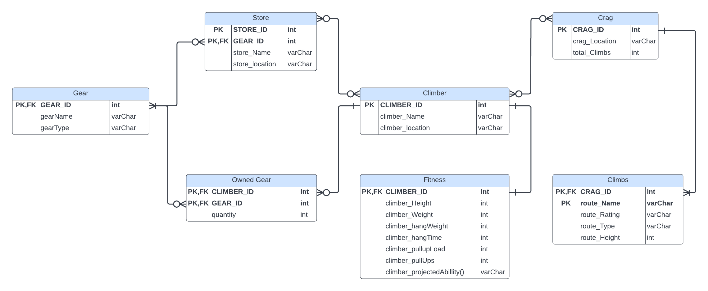

# Phase 1 documentation

<h2>Problem Overview</h2>

The world of climbing is a complex and confusing place, with lots of varied equipment and knowledge to correctly perform the sport. We have been climbing together for a little over 6 months now and share this love for climbing and computer science together. However, due to the innate complexity of climbing, we thought it would be best to create and connect databases to solve the problems we typically encounter. An example of a frequent problem we encounter is gear preparation. When travelling to a climbing hotspot, better known as a ‘CRAG’, having knowledge of what gear you need to bring for whichever type of climbing is critical for your success. Unfortunately, I only have so much gear, and information on these climbing locations isn’t necessarily fruitful. This is where our Database will come in handy. Let’s say we have a list of climbers containing valuable information pertaining to their climbing: the gear they own, their fitness levels, the CRAGs near them, their climbing abilities, etc. We can then take these aspects of climbing that pertain to each individual and provide a map of assistance and recommendations for their climbing enjoyment and success. We started off with an ERD Rough Draft of a conceptual data-model and included these aspects into the ERD. This draft was a good start into our visualization for what the project wanted to be. However, we were able to finalize what we wanted our database to accomplish when we proposed questions that it should solve, here are some examples:

- What city has the most crags? 
- Which crags can host x climbers?
- Where is the easiest climb in x city?
- Do I have enough gear to climb x route?
- Where can I buy x gear?
- Am I strong enough to climb route x?
- What is my expected climbing ability?
- What is the most common type of gear sold at store x?
- Are there other climbers with my name?
- What city has the strongest climber?
- Where does climber x live?
- How many trad/TR/boulders are at crag x?
- How many climbers in city x can climb 6B?
- How many of gear type x do I own?
- What is the hardest climb at crag x?
- How many climbers live in my city?
- How many stores in city x sell gear y?
- How long is route x?
- What type of gear is gear name x?
- Can I climb this route?

After asking these questions, we were able to come up with our Final Draft, and the relationship between each element. With this setup we can easily answer all these questions and have reliable and relatable data for every climber who enters their information correctly.

<h2>Entity Relationship Diagram</h2>

<h2>Relational Schema</h2>

Climber (<ins>CLIMBER_ID</ins>, climber_Name, climber_Location)
  - Primary Key
    - CLIMBER_ID
  - Attributes
    - climber_Name
    - climber_Location
  - Domain
    - climberID: Positive integer
    - climber_Name: string
    - climber_Location: string

Fitness (<ins>CLIMBER_ID</ins>, climber_Height, climber_Weight, climber_hangWeight, climber_hangTime, climber_pullUpLoad, climber_pullUps, climber_projectedAbillity())
  - Primary Key
    - CLIMBER_ID
  - Foreign Key
    - CLIMBER_ID
  - Attributes
    - climber_Height
    - climber_Weight
    - climber_hangWeight
    - climber_hangTime
    - climber_pullUpLoad
    - climber_pullUps
  - Derived Attributes
    - climber_projectedAbillity()
  - Domain
    - CLIMBER_ID: Positive integer
    - climber_Height: integer
    - climber_Weight: integer
    - climber_hangWeight: integer
    - climber_hangTime: integer
    - climber_pullUpLoad: integer
    - climber_pullUps: integer
    - climber_projectedAbillity(): string

Crag (<ins>CRAG_ID</ins>, crag_Name, crag_location, total_Climbs)
  - Primary Key
    - CRAG_ID
  - Attributes
    - crag_Name
    - crag_Location
    - total_Climbs
  - Domain
    - CRAG_ID: Positive integer
    - crag_Name: string
    - crag_Location: string
    - total_Climbs: int

Climbs(<ins>CRAG_ID</ins>, <ins>route_Name</ins>, route_Rating, route_Type, route_Height)
  - Primary Key
    - CRAG_ID
    - route_Name
  - Foreign Key
    - CRAG_ID
  - Attributes
    - route_Rating
    - route_Type
    - route_Height
  - Domain
    - CRAG_ID: Positive integer
    - route_Name: string
    - route_Rating: string
    - route_Type: string
    - route_Height: integer

Gear(<ins>GEAR_ID</ins>, gear_Name, gear_Type)
  - Primary Key
    - GEAR_ID
  - Foreign Key
    - GEAR_ID
  - Attributes
    - gear_Name
    - gear_Type
  - Domain
    - GEAR_ID: int
    - gear_Name: string
    - gear_Type: string

Owned Gear(<ins>CLIMBER_ID</ins>, <ins>GEAR_ID</ins>, quantity)
  - Primary Key
    - CLIMBER_ID
    - GEAR_ID
  - Foreign Key
    - CLIMBER_ID
    - GEAR_ID
  - Attributes
    - quantity
  - Domain
    - CLIMBER_ID: integer
    - GEAR_ID: integer
    - quantity: integer

Store(<ins>STORE_ID</ins>, <ins>GEAR_ID</ins>, store_Name, store_Location)
  - Primary Key
    - STORE_ID
    - GEAR_ID
  - Foreign Key
    - GEAR_ID
  - Attributes
    - store_Name
    - store_Location
  - Domain
    - STORE_ID: integer
    - GEAR_ID: integer
    - store_Name: string
    - store_Location: string

<h2>Functional Dependencies</h2>

Climber (<ins>CLIMBER_ID</ins>, climber_Name, climber_Location)
  - CLIMBER_ID -> climber_Name, climber_Location
  - Normalization:
    - Already in BCNF, it is in 3NF and the left-hand side is a superkey of the relation.
    - Already in 4NF, it is in BCNF and there are no multivalued dependencies.
    
Fitness (<ins>CLIMBER_ID</ins>, climber_Height, climber_Weight, climber_hangWeight, climber_hangTime, climber_pullUpLoad, climber_pullUps, climber_projectedAbillity())
  - CLIMBER_ID -> climber_Height, climber_Weight, climber_hangWeight, climber_hangTime, climber_pullUpLoad, climiber_pullUps, climber_projectedAbillity)
  - Normalizations
    - Already in BCNF, it is in 3NF and the left-hand side is a superkey of the relation.
    - Already in 4NF, it is in BCNF and there are no multivalued dependencies.
    
Crag (<ins>CRAG_ID</ins>, crag_Name, crag_Location, total_Climbs)
  - CRAG_ID -> crag_Name, crag_Location, total_Climbs
  - Normalization:
    - Already in BCNF, it is in 3NF and the left-hand side is a superkey of the relation.
    - Already in 4NF, it is in BCNF and there are no multivalued dependencies.
    
Climbs(<ins>CRAG_ID</ins>, <ins>route_Name</ins>, route_Rating, route_Type, route_Height)
  - CRAG_ID, route_Name -> route_Rating, route_Type, route_Height
  - Normalization:
    - Already in BCNF, it is in 3NF and the left-hand side is a superkey of the relation.
    - Already in 4NF, it is in BCNF and there are no multivalued dependencies
    
Gear(<ins>GEAR_ID</ins>, gear_Name, gear_Type)
  - GEAR_ID -> gear_Name, gear_Type
  - Normalization:
    - Already in BCNF, it is in 3NF and the left-hand side is a superkey of the relation.
    - Already in 4NF, it is in BCNF and there are no multivalued dependencies
    
Owned Gear(<ins>CLIMBER_ID</ins>, <ins>GEAR_ID</ins>, quantity)
  - CLIMBER_ID, GEAR_ID -> quantity
  - Normalization:
    - Already in BCNF, it is in 3NF and the left-hand side is a superkey of the relation.
    - Already in 4NF, it is in BCNF and there are no multivalued dependencies
    
Store(<ins>STORE_ID</ins>, <ins>GEAR_ID</ins>, store_Name, store_Location)
  - STORE_ID, GEAR_ID -> store_Name, store_Location
  - Normalization:
    - Already in BCNF, it is in 3NF and the left-hand side is a superkey of the relation.
    - Already in 4NF, it is in BCNF and there are no multivalued dependencies

<h2>Sample Data</h2>

Climber (<ins>CLIMBER_ID</ins>, climber_Name, climber_Location)

| **CLIMBER_ID** 	| **climber_Name** 	| **climber_Location** 	|
|----------------	|------------------	|----------------------	|
| 01             	| Kyle Perry       	| Richmond             	|
| 02             	| Joshua Hayes     	| Richmond             	|
| 03             	| Alex Honnold     	| San Francisco        	|
| 04             	| Adam Ondra       	| Brno                 	|

Fitness (<ins>CLIMBER_ID</ins>, climber_Height, climber_Weight, climber_hangWeight, climber_hangTime, climber_pullUpLoad, climber_pullUps, climber_projectedAbillity())

| **CLIMBER_ID** 	| **climber_Height** 	| **climber_Weight** 	| **climber_hangWeight** 	| **climber_hangTime** 	| **climber_pullUpLoad** 	| **climber_pullUps** 	| **climber_projectedAbillity()** 	|
|----------------	|--------------------	|--------------------	|------------------------	|----------------------	|------------------------	|---------------------	|---------------------------------	|
| 01             	| 75                 	| 190                	| 45                     	| 7                    	| 50                     	| 5                   	| 7A                              	|
| 02             	| 68                 	| 135                	| 60                     	| 7                    	| 60                     	| 8                   	| 7B+                             	|
| 03             	| 68                 	| 125                	| 120                    	| 10                   	| 90                     	| 10                  	| 8B+                             	|
| 04             	| 73                 	| 150                	| 165                    	| 17                   	| 90                     	| 12                  	| 9A                              	|

Crag (<ins>CRAG_ID</ins>, crag_Name, crag_Location, total_Climbs)

| **CRAG_ID** | **crag_Name**       	| **crag_Location** | **total_Climbs** 	|
|------------	|---------------------	|---------------	  |-----------------	|
| 01      	  | Manchester Wall     	| Richmond      	  | 56              	|
| 02        	| Belle Isle Quarries 	| Richmond      	  | 17              	|

Climbs(CRAG_ID, route_Name, route_Rating, route_Type, route_Height)

| CRAG_ID 	| route_Name      	| route_Rating 	| route_Type 	| route_Height 	|
|---------	|-----------------	|--------------	|------------	|--------------	|
| 01      	| Tendinitis      	| 6b           	| TR, Sport  	| 60           	|
| 01      	| Root Canal      	| 5c           	| TR, Sport  	| 50           	|
| 02      	| Dynamite Shute  	| 5b           	| TR         	| 30           	|
| 02      	| Pulling Punches 	| 4c           	| TR, Sport  	| 30           	|

Gear(GEAR_ID, gear_Name, gear_Type)

| **GEAR_ID** 	| **gear_Name**          	| **gear_Type** 	|
|-------------	|------------------------	|---------------	|
| 01          	| Scarpa Helix           	| Shoes          	|
| 02          	| Petzl Gri Gri          	| Belay Device  	|
| 03          	| 60m Black Diamond Rope 	| Rope          	|

Owned Gear(CLIMBER_ID, GEAR_ID, quantity)

| CLIMBER_ID 	| GEAR_ID 	| quantity 	|
|------------	|---------	|----------	|
| 01         	| 01      	| 1        	|
| 02         	| 02      	| 1        	|
| 02         	| 03      	| 2        	|

Store(STORE_ID, GEAR_ID, store_Name, store_Location)

| **STORE_ID** 	| **GEAR_ID** 	| **store_Name**       	| **store_Location** 	|
|--------------	|-------------	|----------------------	|--------------------	|
| 01           	| 01          	| REI                  	| Richmond           	|
| 01           	| 03          	| REI                  	| Richmond           	|
| 02           	| 01          	| Walkabout Outfitters 	| Richmond           	|
