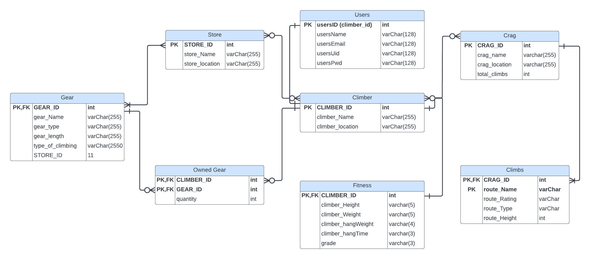

1. Problem Statement:

The world of climbing is a complex and confusing place, with lots of varied equipment and knowledge required to correctly perform the sport. Due to the innate complexity of climbing, only a database can help solve the problems we typically encounter.

An example of a frequent problem you may encounter as a climber is gear preparation. When traveling to a climbing hotspot, better known as a ‘crag’, having knowledge of what gear you need to bring for whichever type of climbing is critical for your success. Unfortunately, information on these climbing locations isn’t necessarily fruitful. This is where this database will come in handy.

Let’s say you, the climber, knows valuable information pertaining to your climbing: the gear you own, your fitness levels, the crags near you, etc. This web app allows you to store these aspects of climbing that pertain to you alone and provide a map of assistance and recommendations for your climbing enjoyment and success.

2. System Users: 

- Climbers
  The default user for this webapp is a rock climber. This user has access to a "Profile" page where they can see details gathered when their account was created as well as an option to update their home location. This user also has access to the "Gear" page where they can CRUD a personal database of owned gear. Climbers also have access to the "Climbs”' page where they can access various rock climbs organized by crag and filter based on the route's name, rating, type, length, and stars. Lastly, the climber can access the "Fitness" page where the user can update stored fitness information and receive a resulting estimated projecting grade.  

- Admin 
  The admin user is assigned to one account based on the unique userID assigned at account creation. This user has access to all previously mentioned pages as well as a page listing all climbers filterable by location. 

3. Updated ER diagram: 

4. Lessons Learned / improvements:

- Josh 
  This is by far my favorite project I've done as a CS student. For the first time it felt like I was really creating something with my degree, rather than doing academic exercises for the sake of learning theory. This project allowed me to be creative, challenged me, and forced me to learn new skills quickly. The biggest lesson I learned was the importance of having a partner you can rely on. Kyle and I were able to work effectively as a team (probably since we trust each other with our lives while climbing together), and as a result we have a finished product we can be proud of. This project also taught me that the best way to learn and improve my programming skills is to program. While I have wanted to do web development before this project, I suffered from paralysis due to lack of knowledge and feeling like I didn't know enough to be able to start. This project reminded me that sucking at something is the first step of being good at something. 

  If I were to make improvements to the final I would have liked to see more resources for PHP development earlier in the semester. I was able to learn lots through YouTube tutorials, but still felt lost at times if I ran into an error. Perhaps a simple sample project with example code could solve this. Also, at times it felt like a scavenger hunt to find resources from lectures and posted videos on the canvas. A module in canvas dedicated to information such as phpMyAdmin login and connecting to the database in an IDE would have been appreciated but wasn't too much of a hassle. 
  
- Kyle
  Lessons learned is that with lots of hard work, dedication, and tears, you can learn any language with no problems! But in all seriousness, this project made me excited for my professional career after college, combining knowledge from js, css, php, and python, all languages I learned within this year, its cool to see real life applications of what can be done with my knowledge.

  This was an amazing course and I learned a lot from it, but to back up Josh, implementing my knowledge with PhP maybe could have been easier with an earlier introduction and maybe some 'getting started' examples taught. We figured it out eventually but it definitely was a lot of trial and error with not much success, and a lot of help from youtube.

5. Link to website -> cmsc508.com/202310/team34

6. Link to video -> https://youtu.be/tBTNfZckgx8
